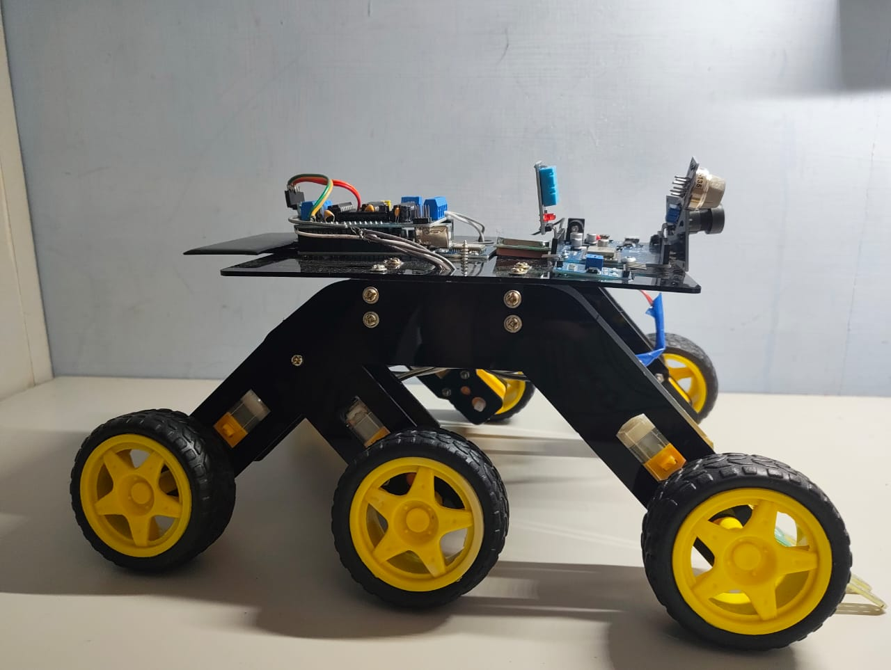

# 🤖 6-Wheel Bluetooth Controlled Smart Rover

A six-wheel Arduino-based robotic rover designed for Bluetooth remote control and environmental sensing. The rover uses **six DC gear motors** arranged as three motors on each side, an Arduino-based control system, a motor driver, and a Bluetooth module.

The project also includes a **Flask-based smart sensor dashboard** for displaying environmental information such as temperature, humidity, soil moisture, gas status, and approximate device location.

![6-Wheel Smart Rover]

## 🚀 Features

- 📱 Bluetooth control using a mobile RC Controller app
- 🛞 Six-wheel drive: 3 left motors + 3 right motors
- ⬆️ Forward and backward movement
- ↩️ Left and right turning
- 🛑 Stop control
- 🌡️ Temperature monitoring
- 💧 Humidity monitoring
- 🪴 Soil-moisture monitoring
- 🔥 MQ-2 gas detection
- 🌍 IP-based approximate device location
- 🗺️ OpenStreetMap location display
- 🌐 Flask-based live web dashboard

## 🧩 System Architecture

```text
                 Bluetooth RC Controller App
                           │
                           │ Bluetooth
                           ▼
                    Bluetooth Module
                           │
                           ▼
                        Arduino
                           │
                     Motor Driver
                    ┌──────┴──────┐
                    ▼             ▼
              Left Motors     Right Motors
               M1 M2 M3        M4 M5 M6


Sensors ──► Raspberry Pi ──► Flask Server
                                      │
                                      ▼
                               Web Dashboard
```

## 🛠️ Hardware

The rover can be built using components such as:

- Arduino board
- Bluetooth module (for example HC-05/HC-06)
- Motor driver/shield
- 6 × DC gear motors
- 6 × wheels
- Robot chassis
- Temperature/humidity sensor
- Soil-moisture sensor
- MQ-2 gas sensor
- Raspberry Pi or another computer for the Flask dashboard
- Suitable battery/power supply
- Jumper wires and connectors

> **Note:** Exact Arduino, motor-driver, Bluetooth-module and sensor models should be updated here to match the hardware used in the final rover.

## 🎮 Bluetooth Commands

The Arduino firmware can use the following simple command protocol:

| Command | Movement |
|---|---|
| `F` | Forward |
| `B` | Backward |
| `L` | Left |
| `R` | Right |
| `S` | Stop |

The Bluetooth RC Controller app sends a command to the Bluetooth module. The Arduino receives the character and controls the motor driver accordingly.

### Six-Wheel Movement Logic

| Movement | Left 3 Motors | Right 3 Motors |
|---|---|---|
| Forward | Forward | Forward |
| Backward | Backward | Backward |
| Left | Backward | Forward |
| Right | Forward | Backward |
| Stop | Stop | Stop |

## 🌱 Smart Sensor Dashboard

The included Flask application communicates with an Arduino Nano over serial at **9600 baud** and reads JSON sensor data. The current backend expects temperature, humidity, and soil-moisture readings from the Arduino and reads an MQ-2 gas sensor through GPIO.

The dashboard displays:

- Temperature
- Humidity
- Soil moisture
- Gas detection status
- Approximate IP-based location
- OpenStreetMap map view

Sensor values on the web page are refreshed every **2 seconds**.

## 📁 Suggested Repository Structure

```text
6-Wheel-Bluetooth-Smart-Rover/
│
├── README.md
├── 1000064575.jpg
│
├── arduino/
│   └── bluetooth_6wheel_robot.ino
│
├── app.py
│
└── templates/
    └── dashboard.html
```

`dashboard.html` should be inside the `templates` directory because Flask's `render_template()` function loads HTML templates from that folder by default.

## 💻 Running the Dashboard

### 1. Install Python dependencies

```bash
pip install flask gpiozero pyserial requests
```

### 2. Connect the Arduino

The current Flask code expects the Arduino serial connection at:

```text
/dev/ttyUSB0
```

Change this in `app.py` if your Arduino appears on another serial port.

### 3. Start the Flask server

```bash
python3 app.py
```

The application runs on port `5000`.

Open a browser on the device running the server and visit:

```text
http://localhost:5000
```

For another device on the same network, use the server device's local IP address with port `5000`.

## 📡 Sensor Data Format

The Flask backend expects serial data from the Arduino in JSON format similar to:

```json
{
  "temp": 28.5,
  "hum": 65,
  "soil": 47
}
```

## 🔄 Working Principle

1. The user selects a movement direction in the Bluetooth RC Controller app.
2. The phone transmits a character such as `F`, `B`, `L`, `R`, or `S`.
3. The Bluetooth module forwards the command to the Arduino.
4. The Arduino interprets the command.
5. The motor driver supplies the required direction/current to the motors.
6. Three motors on each side operate together to move or turn the rover.
7. Environmental sensors collect measurements.
8. Sensor readings are transferred to the Flask application.
9. The browser dashboard periodically retrieves the latest readings and displays them.

## ⚠️ Power and Safety

Six DC gear motors can require significantly more current than an Arduino can supply. The motors should be powered through a suitable motor driver and external motor power source.

Do **not** power all six motors directly from the Arduino 5 V pin.

Make sure the selected motor driver can handle the combined operating and stall current of the connected motors.

## 🔮 Future Improvements

Possible extensions include:

- Obstacle avoidance
- Autonomous navigation
- GPS tracking
- Camera streaming
- Speed control using PWM
- Battery-level monitoring
- Sensor-data logging
- Mobile/web-based remote control
- IoT/cloud monitoring

## 📸 Prototype

The current prototype uses a six-wheel chassis with three driven wheels on each side and electronics mounted on the upper platform.



## 📄 License

This project is intended for educational and research purposes.
